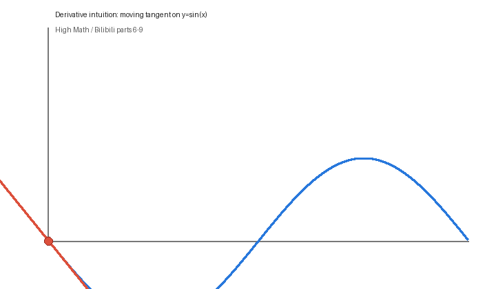
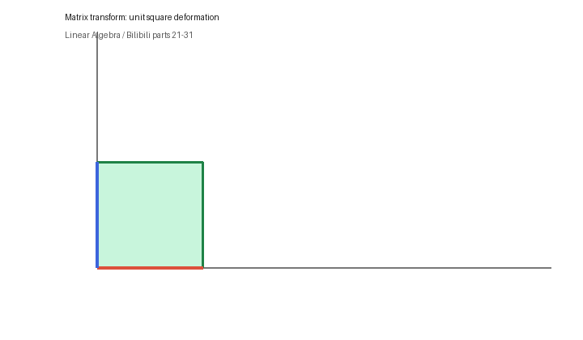
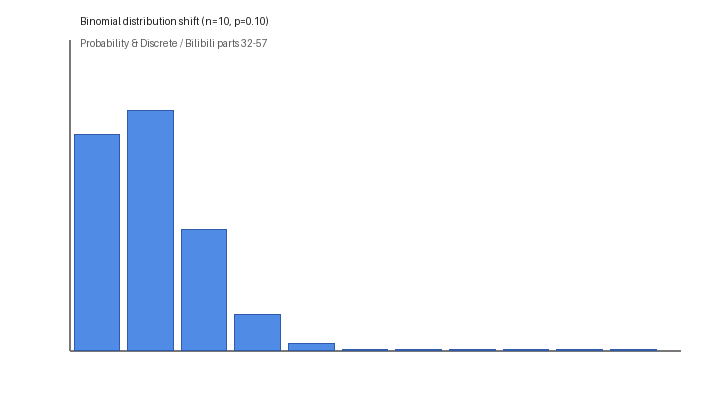

# 基础数学（按主题重构）

你要的结构已经调整为三大块：

1. 高等数学（函数、极限、导数、积分、优化）
2. 线性代数（矩阵、特征值、SVD、核函数）
3. 概率与离散（随机变量、分布、MLE、统计检验、贝叶斯）

## 资料对齐说明

- B站课程：<https://www.bilibili.com/video/BV1gQ4y1E7iy>
- 短链来源：<https://b23.tv/Yiosvlc>
- D2L 线性网络：<https://zh.d2l.ai/chapter_linear-networks/index.html>

本目录中的章节标题与内容安排，按 B站分集顺序做了映射，并额外补了 D2L 线性网络的应用视角。

## 学习入口

- [高等数学](./高等数学/README.md)
- [线性代数](./线性代数/README.md)
- [概率与离散](./概率与离散/README.md)
- [课程映射总表](./课程映射.md)
- [数学速查手册](./数学速查手册.md)

## 动图预览（GitHub 可直接播放）

### 高数变化（导数切线）

### 矩阵变化（线性变换）

### 概率变化（二项分布随 p 变化）

## 推荐学习顺序

1. 高等数学：先把导数、积分、优化概念打牢。
2. 线性代数：重点理解“变换”和“特征空间”。
3. 概率与离散：建立建模与统计判断能力。
4. 回到 D2L 线性网络章节，做线性回归与 softmax 的最小项目实践。
